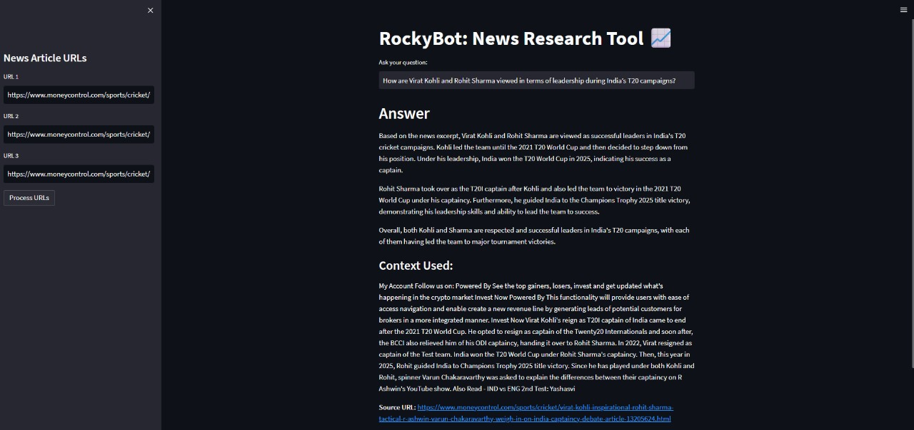

# News Research Tool with LangChain & Mistral

A Streamlit-based AI-powered assistant that summarizes and answers questions based on news articles. Built using LangChain, Mistral AI, and BeautifulSoup.



---

## Features

- Takes up to 3 news article URLs as input
- Extracts and cleans text from the articles using BeautifulSoup
- Identify the most relevant content using TF-IDF Vectorizer and cosine similarity
- Generate answers using LangChain's ChatMistralAI integration
- Displays the answer and the source text used
- Built with a simple and interactive Streamlit interface

---

## Installation

### 1 Clone the repository

```
git clone https://github.com/keyoor123/News-Research-Tool.git
```

### 2 Navigate to the project directory

```
cd News-Research-Tool-
```

### 3 Install dependencies

```
pip install -r requirements.txt
```

### 4 Set up your API key

Create a .env file in the root directory with the following:
```
MISTRAL_API_KEY=your_actual_mistral_api_key_here
```

### 5 Run the app

```
streamlit run tool.py
```

---

## Project Structure

- tool.py: The main Streamlit application that runs the News Research Tool.
- requirements.txt: A list of required Python packages for the project.
- .env: Configuration file for storing your Mistral API key securely.
- README.md: Documentation file that explains the project, features and setup.
